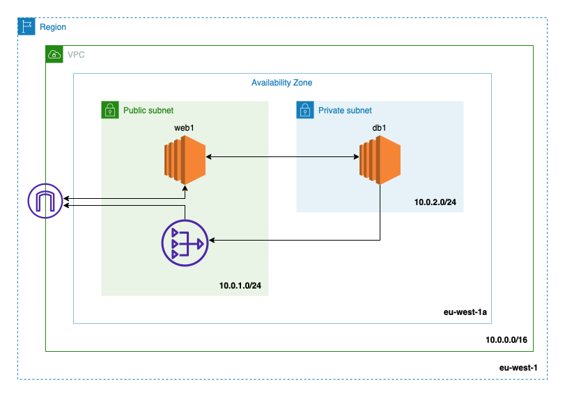
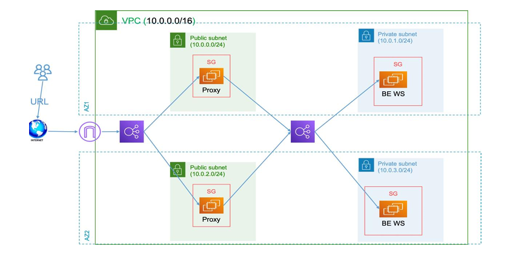

# Terraform AWS Infrastructure

      

This project uses Terraform to create and manage AWS infrastructure. The infrastructure is divided into two sub-projects: Day 1 and Day 2, each focusing on different aspects of the AWS setup.

## Labs Overview

- **Day 1**: Basic VPC setup with subnets, internet gateway, NAT gateway, security groups, and EC2 instances.
- **Day 2**: Advanced setup including additional subnets, NAT gateways, route tables, security groups, application load balancer, auto-scaling group, and more.
- **Day 3**: Modularized Terraform configuration—created a structured modules approach with dedicated outputs, variables, workspaces, shared state files, and implemented conditions and loops for dynamic resource management.

## Days-Lab

### Day 1
Each Lab will be deployed in a separate branch 


Basic AWS infrastructure setup including:
- VPC
- Subnets
- Internet Gateway
- NAT Gateway
- Security Groups
- EC2 Instances

For detailed information, visit the [Day 1 README](https://github.com/Amr-Awad/NTI-Terraform/blob/Day-1/readme.md).

### Day 2


Advanced AWS infrastructure setup including:
- Additional Subnets
- NAT Gateways
- Route Tables
- Security Groups
- Application Load Balancer
- Auto-Scaling Group

For detailed information, visit the [Day 2 README]([Day2/README.md](https://github.com/Amr-Awad/NTI-Terraform/blob/Day-2/readme.md)).

### Day 3



Using modules and varaiables to create this diagram:
- Public Load Balancer
- private Load Balancer
- Subnets
- Secuirty Groups
- EC2s

For detailed information, visit the [Day 3 README](https://github.com/Amr-Awad/NTI-Terraform/blob/Day-3/readme.md).

## Usage

Each lab is deployed in a separate branch. To apply the Terraform configuration and create the infrastructure, navigate to the respective sub-project directory and run the following commands.

### For Day 1 Lab

1. Checkout the **Day-1** branch:
    ```sh
    git checkout Day-1
    git pull origin Day-1
    ```

2. Initialize Terraform:
    ```sh
    terraform init
    ```

3. Apply the Terraform configuration:
    ```sh
    terraform apply
    ```

For Day 1 Branch, visit the [Day 1 Branch](https://github.com/Amr-Awad/NTI-Terraform/blob/Day-1).

---

### For Day 2 Lab

1. Checkout the **Day-2** branch:
    ```sh
    git checkout Day-2
    git pull origin Day-2
    ```

2. Initialize Terraform:
    ```sh
    terraform init
    ```

3. Apply the Terraform configuration:
    ```sh
    terraform apply
    ```

For Day 2 Branch, visit the [Day 2 Branch](https://github.com/Amr-Awad/NTI-Terraform/blob/Day-2).

---

### For Day 3 Lab

1. Checkout the **Day-3** branch:
    ```sh
    git checkout Day-3
    git pull origin Day-3
    ```

2. Initialize Terraform:
    ```sh
    terraform init
    ```

3. Apply the Terraform configuration:
    ```sh
    terraform apply
    ```

For Day 3 Branch, visit the [Day 3 Branch](https://github.com/Amr-Awad/NTI-Terraform/blob/Day-3).
