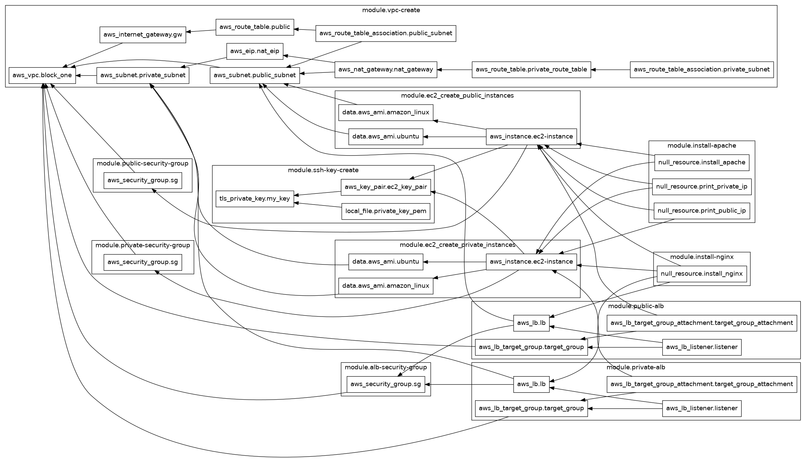

# TERRAFORM

      


## Overview
This Terraform project builds a Virtual Private Cloud (VPC) in AWS with high availability, public and private subnets, NAT gateways, and Application Load Balancers (ALBs) to manage traffic routing between instances. Public EC2 instances run NGINX as reverse proxies, forwarding requests to private EC2 instances running Apache.

---

## Architecture
### Architecture Diagram


The architecture includes:
- **VPC with Two Availability Zones (AZs):**
  - Each AZ has a public and private subnet.
  - Public subnets are connected to an Internet Gateway (IGW).
  - Private subnets are connected through a NAT Gateway.

- **Application Load Balancers (ALBs):**
  - **Public ALB:** Routes requests from the Internet Gateway to public instances.
  - **Private ALB:** Routes requests from public instances to private instances.

- **EC2 Instances:**
  - **Public Instances:** Run NGINX configured as reverse proxies to forward traffic to the private ALB.
  - **Private Instances:** Run Apache web servers that serve simple HTML responses.

---

## Terraform Module Graph
The diagram below represents the dependency graph of our Terraform configuration. Each node in the graph corresponds to a module or a resource block, and the directed arrows indicate the dependency relationships between them.



**Graph Overview:**

- **Core Network Foundation:**  
  At the heart of the graph is the `vpc-module`, which sets up the Virtual Private Cloud (VPC), including public and private subnets, route tables, and Internet/NAT gateways. This module is the backbone of the infrastructure, and many other modules depend on it.

- **Load Balancers:**  
  The `alb-module` is directly linked to the `vpc-module`, as it requires the networking components to create Application Load Balancers (ALBs) for both public and internal routing. This module ensures that incoming traffic is distributed appropriately across the EC2 instances.

- **Compute Resources:**  
  The `ec2-module` nodes for public and private instances are connected to the VPC module. These nodes represent the creation of EC2 instances that host the application services. Public instances, which run NGINX, depend on the VPC for network placement and the ALB for receiving traffic, while private instances, running Apache, are linked to the private subnet configuration.

- **Software Provisioning:**  
  Modules like `install-nginx-module` and `install-apache-module` are attached to their corresponding EC2 instances. These modules ensure that, once the instances are up, the necessary software is automatically installed and configured.

- **Security and Access:**  
  The `security-groups-module` and `ssh-key-module` are essential for securing the EC2 instances. They are connected as dependencies to ensure that proper access control and secure SSH access are established before the instances are fully provisioned.

<p>This modules graph visually communicates the layered structure of our Terraform setup: beginning with the core networking components, followed by the provisioning of compute resources, load balancers, and finally, software configuration and security. It’s a helpful tool for understanding the interdependencies and orchestration within our infrastructure code.</p>

---

## Project Structure
```plaintext
├── modules
│   ├── alb-module
│   │   ├── main.tf
│   │   ├── variables.tf
│   │   └── outputs.tf
│   ├── ec2-module
│   │   ├── main.tf
│   │   ├── variables.tf
│   │   └── outputs.tf
│   ├── install-nginx-module
│   │   ├── main.tf
│   │   ├── variables.tf
│   │   └── outputs.tf
│   ├── install-apache-module
│   │   ├── main.tf
│   │   ├── variables.tf
│   │   └── outputs.tf
│   ├── security-groups-module
│   │   ├── main.tf
│   │   ├── variables.tf
│   │   └── outputs.tf
│   ├── ssh-key-module
│   │   ├── main.tf
│   │   ├── variables.tf
│   │   └── outputs.tf
│   └── vpc-module
│   │   ├── main.tf
│   │   ├── variables.tf
│   │   └── outputs.tf
├── alb-create.tf
├── ec2-create.tf
├── install-apache-nginx.tf
├── security-group-create.tf
├── shared-state.tf
├── ssh-create-key.tf
└── vpc-create.tf
```

- **alb-create.tf:** Configuration for creating Application Load Balancers (ALBs).  
- **ec2-create.tf:** Definition and creation of EC2 instances for public and private subnets.  
- **install-apache-nginx.tf:** Automates the installation of NGINX on public instances and Apache on private instances.  
- **security-group-create.tf:** Creates security groups for ALBs, public instances, and private instances.  
- **shared-state.tf:** Backend configuration to store Terraform state in an S3 bucket and DynamoDB table.  
- **ssh-create-key.tf:** Creates SSH key pairs for secure instance access.  
- **vpc-create.tf:** Builds the VPC with subnets, route tables, and internet gateways.  

---

## Prerequisites for Deployment

### 1. Create the S3 Bucket and DynamoDB Table for Terraform Backend

#### S3 Bucket Creation
```bash
aws s3api create-bucket --bucket <your-s3-bucket-name> --region <region>
```
Ensure that the bucket has versioning enabled:
```bash
aws s3api put-bucket-versioning --bucket <your-s3-bucket-name> --versioning-configuration Status=Enabled
```

#### DynamoDB Table Creation
```bash
aws dynamodb create-table \
    --table-name <your-dynamo-db-table-name> \
    --attribute-definitions AttributeName=LockID,AttributeType=S \
    --key-schema AttributeName=LockID,KeyType=HASH \
    --billing-mode PAY_PER_REQUEST
```

#### Update the Terraform Backend in `shared-state.tf`:
```hcl
terraform {
  backend "s3" {
    bucket         = "<your-s3-bucket-name>"
    key            = "terraform/state"
    region         = "<region>"
    dynamodb_table = "<your-dynamo-db-table-name>"
  }
}
```

---

## Post-Deployment Steps
### Verify NGINX and Apache Configuration
1. Connect to the public EC2 instances using SSH.
```bash
ssh -i <path-to-private-key> ubuntu@<public-ec2-ip>
```
2. Check that NGINX is running and configured to forward traffic to the private ALB.
```bash
sudo systemctl status nginx
```

### Test Apache Web Server
1. Use `curl` to test Apache on private instances.
```bash
curl http://<private-ec2-ip>
```
Expected output:
```html
<h1>Welcome to private instance <private-ec2-ip></h1>
```

---

## Variables and Outputs
### Key Variables and Outputs
Below are essential variables and outputs that help configure and deploy the infrastructure.

#### Locals
- **public_instance_ids:** Flattened list of instance IDs for public EC2 instances.
- **private_instance_ids:** Flattened list of instance IDs for private EC2 instances.
- **public_instance_ips:** Flattened list of public IPs for public EC2 instances.
- **private_instance_ips:** Flattened list of private IPs for private EC2 instances.

#### ALB Module Variables and Outputs
- **vpc-id:** The ID for the VPC where the ALB is deployed.
- **alb-name:** Custom name for the ALB.
- **is-internal:** Boolean to determine if the ALB is internal or internet-facing.
- **alb-type:** Type of the ALB (either application or network).
- **subnet-ids:** List of subnet IDs where the ALB will be deployed.
- **alb-sg-id:** Security group ID for the ALB.
- **instance-ids:** List of instance IDs for target instances.
- **target-group-name:** Name of the ALB target group.
- **lb-listener-port:** Port for the ALB listener.
- **lb-listener-protocol:** Protocol used by the ALB listener.
- **alb-id:** Outputs the ALB ID.
- **alb-dns:** Outputs the DNS name of the ALB.

#### EC2 Module Variables and Outputs
- **subnet-id:** ID of the subnet where the instance is deployed.
- **sg-id:** Security group ID for the instance.
- **instance-type:** Type of EC2 instance to deploy.
- **linux-type:** OS type for the instance (Amazon Linux or Ubuntu).
- **ssh-key:** Name of the SSH key pair for instance access.
- **is-public:** Boolean to determine if the instance has a public IP.
- **instance-id:** Outputs the instance ID.
- **instance-ip:** Outputs either public or private IP based on the instance's public/private nature.
- **instance_ids:** List of created instance IDs.
- **instance_ips:** Conditional output for public or private IP addresses.

#### Security Group Outputs
- **sg-id:** Security group ID created for the infrastructure.

#### VPC Module Outputs
- **vpc-id:** Outputs the ID of the created VPC.
- **public_subnet_ids:** List of public subnet IDs.
- **private_subnet_ids:** List of private subnet IDs.
- **vpc-cidr:** CIDR block of the VPC.
- **subnets:** List of all created subnet IDs.
- **private_subnet_validation:** Validation for private subnet configurations.
- **public_subnet_validation:** Validation for public subnet configurations.

---

## Troubleshooting
### Common Issues
#### 1. ALB Not Forwarding Requests
- Ensure that ALB listeners are correctly configured.
- Verify target group attachments.

#### 2. NGINX Misconfiguration
- Check the NGINX configuration at `/etc/nginx/sites-available/default`.

#### 3. Apache Not Serving Content
- Verify that Apache is running.
```bash
sudo systemctl status httpd
```

#### 4. SSH Connection Issues
- Ensure the security group allows SSH traffic.
- Verify the correct key pair is being used.

---

## Usage

To deploy the Terraform configuration from the **Day-3** branch, follow these steps:

1. **Checkout the Day-3 branch and pull the latest changes:**
    ```sh
    git checkout Day-3
    git pull origin Day-3
    ```

2. **Initialize Terraform:**
    ```sh
    terraform init
    ```

3. **Apply the Terraform configuration:**
    ```sh
    terraform apply
    ```

---

## Conclusion
This project demonstrates a complete AWS VPC setup with multi-AZ architecture, ALBs, and instance configuration for scalable and secure application deployment. The Terraform configuration ensures an automated, modular infrastructure as code solution for cloud-based applications.
